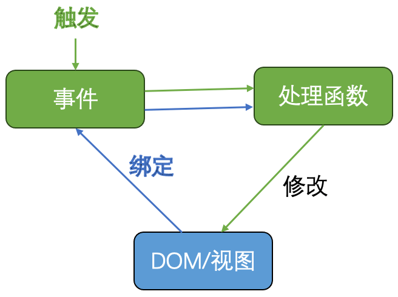
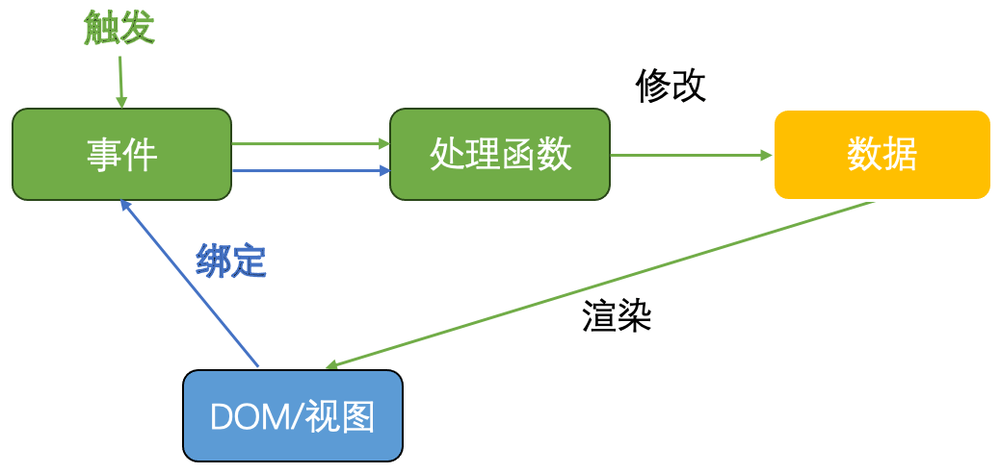

# 从事件驱动到数据驱动
## 一、通过事件驱动实现的富文本编辑器
[通过事件驱动实现的富文本编辑器](https://raw.githack.com/CongYao1993/editor.js/main/richEditor.html)

问题：
1. 用execCommand实现编辑，受浏览器实现的限制
    - 浏览器的具体实现方式是黑盒
    - fontSize只支持1-7，不支持自定义的字号大小
    - formatBlock只支持h1-h6、p、pre等，不支持自定义的样式
    - 不支持复杂功能，如：待办、表格、代码块等
    - 兼容性问题，如：chrome不支持paste，通过document.queryCommandSupported('paste')查看浏览器是否支持xx命令
2. 不同浏览器存储的HTML可能不同，导致语义上相等，但数据上不等
    - 如：bold命令的HTML存储可能为&lt;b&gt;或&lt;strong&gt;，先倾斜后加粗&lt;b&gt;&lt;i&gt;xx&lt;/i&gt;&lt;/b&gt;，先加粗后倾斜&lt;i&gt;&lt;b&gt;xx&lt;/b&gt;&lt;/i&gt;

解决方案：
1. HTML存储 -> 自定义存储格式
2. execCommand修改文档 -> 自己实现修改文档的操作

## 二、从事件驱动到数据驱动
按照“用户交互通过事件修改页面”的思想设计前端网页，在原生js和jQuery开发时，常用这种设计方式。  
设计DOM -> 设计DOM上需要监听的事件 -> 设计事件的处理函数  

按照“用户交互通过修改数据影响页面”的思想设计前端网页，在使用React+Redux,Vue,Angular,Backbone等框架开发时，常用这种设计方式。  
设计数据 -> 设计视图 -> 设计事件监听 -> 设计修改数据的处理函数  

数据驱动设计思想的好处：
- 数据和视图分开，利于解耦
- 数据层抽象设计，利于复用和扩展
- 视图层结构简单，利于组件化