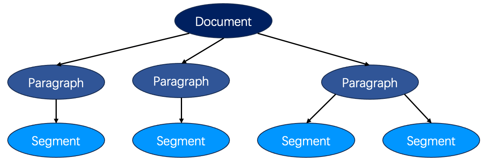

# 用数据驱动思想设计富文本编辑器

## 富文本的数据结构

### HTML
```html
<div style="text-align:right">
    this is a text with inline style
    <b>bold</b>,
    <i>italic</i>,
    <u>underline</u>,
    <span style="color:red">color red</span>
    and block style align right
</div>
```
问题：HTML中语义相等，数据可能不相等。

### Markdown
```markdown
this is a text with inline style **bold**, *italic* and ++underline++
```
问题：markdown样式比较单一，不能满足所有的富文本样式需求。

### 自定义数据结构

**三层数据结构**  
富文本文档由三层数据结构组成：
1. 文档：表示整片文档
2. 段落：表示以回车分割的一个文本段落
3. 文本：表示段落中的文本字符  



```javascript
{
    'type': 'document',
    'nodes': [
        {
            'type': 'paragraph',
            'text': 'this is a plain text'
        }
    ]
}
```

**设计段落样式**  
```javascript
{
    'type': 'document',
    'nodes': [
        {
            'type': 'paragraph',
            'text': 'this is a plain text'
        },
        {
            'type': 'paragraph',
            'text': 'this is a text with block style',
            'style': { 'textAlign': 'center' }
        }
    ]
}
```

**设计行内样式**  
如果字符的行内样式完全相同，将多个连续字符合并为一个片段。  
方式一：  
```javascript
{
    'type': 'document',
    'nodes': [
        {
            'type': 'paragraph',
            'segments':[
                { 'text': 'abcde', 'style': { 'fontWeight': 'bold', 'color': 'red' } },
                { 'text': 'f' },
                { 'text': 'ghi', 'style': { 'fontWeight': 'bold', 'color': 'red' } },
                { 'text': 'jk', 'style': { 'fontWeight': 'bold', 'color': 'green' } },
                { 'text': 'lmn', 'style': { 'fontWeight': 'bold', 'color': 'red' } }
            ],
            'style': { 'textAlign': 'center' }
        }
    ]
}
```
方式二：  
```javascript
{
    'type': 'document',
    'nodes': [
        {
            'type': 'paragraph',
            'text': 'abcdefghijklmn'
            'inline':[
                { 'type': 'fontWeight', 'value': 'bold', 'from': 0, 'to': 4 },
                { 'type': 'fontWeight', 'value': 'bold', 'from': 6, 'to': 13 },
                { 'type': 'color', 'value': 'red', 'from': 0, 'to': 4 },
                { 'type': 'color', 'value': 'red', 'from': 6, 'to': 8 },
                { 'type': 'color', 'value': 'green', 'from': 9, 'to': 10 },
                { 'type': 'color', 'value': 'red', 'from': 11, 'to': 13 }
            ],
            'style': { 'textAlign': 'center' }
        }
    ]
}
```